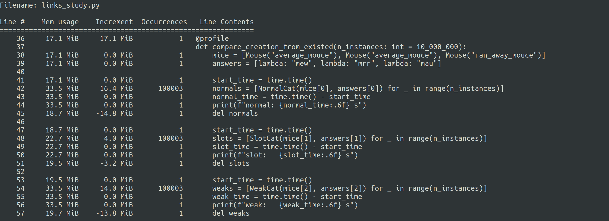
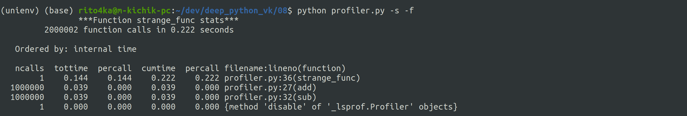

**Task 1**

In this task classes from [link_study.py](https://github.com/m-kichik/deep_python_vk/blob/master/08/links_study.py) are studied:
[NormalCat](https://github.com/m-kichik/deep_python_vk/blob/master/08/links_study.py#L16) with **normal** attributes,
[SlotCat](https://github.com/m-kichik/deep_python_vk/blob/master/08/links_study.py#L22) with **slot** attributes,
[WeakCat](https://github.com/m-kichik/deep_python_vk/blob/master/08/links_study.py#L30) with **weakref.ref** attributes.
Calculations were made with Intel Core i7 11 gen. The following table represents the average time per 10.000.000 iterations.

|           | Creation time with existed args (10-6 s) | Creation time with new args (10-6 s) | Attribute access time (10-6 s) | Attribute change time (10-6 s) |
|-----------|----------------------------------------|------------------------------------|------------------------------|------------------------------|
| *normal*  | 0.3953                                  | 1.1139                             | 0.01266                       | 0.1711                        |
| *slot*    | 0.2830                                  | 0.9385                              | 0.01234                       | 0.1726                        |
| *weakref* | 0.4446                                  | 0.9081                              | 0.06703                       | 0.1904                        |

As well as expected, ''slot'' class win in the creation task (because it omits \_\_dict\_\_ creation) and work the same way
with ''normal'' class in other tasks. ''Weakref'' class work slow in the creation task (maybe because of the weakref lib work costs),
but it work better in the attribute access task (not in the attribute change task).

**Task 2**

In this task we deal with 100.000 iterations, because memory_profiler.profile works much slower than functions to profile. As it was expected, ''slot'' class consumes less memory at the time of creation in both cases (difference between ''slot'' and other classes remains nearly the same): creation from existed attrs (first picture) and creation with new args (second picture).

**Task 3**

Custom profiler based on the cProfiler.

